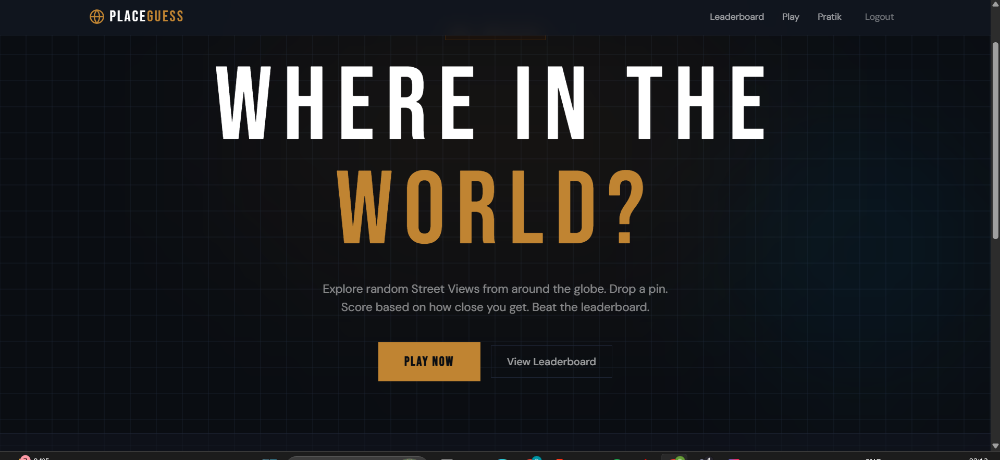
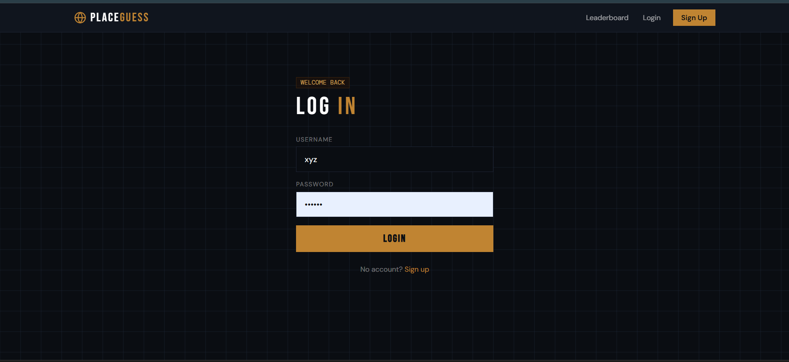
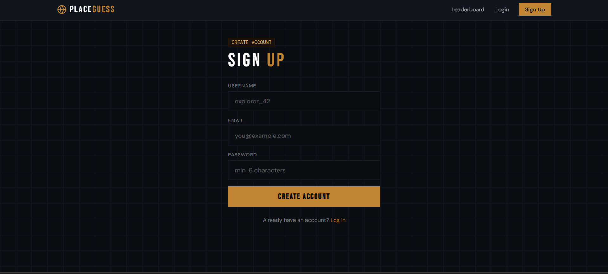
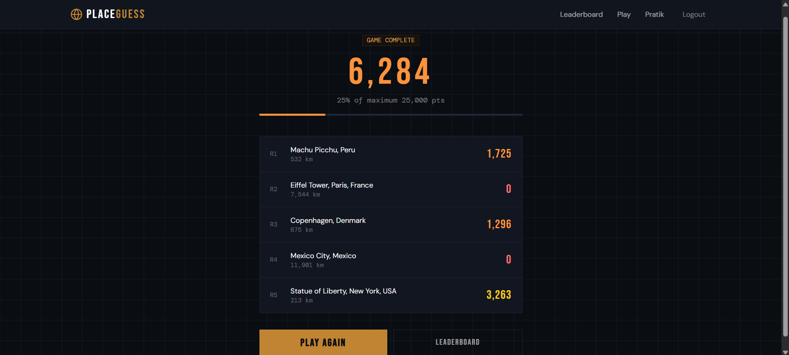
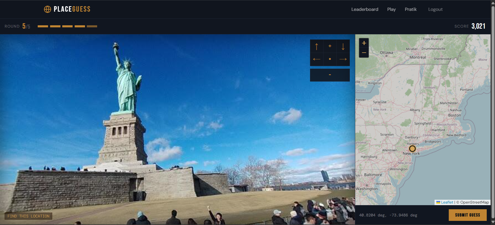
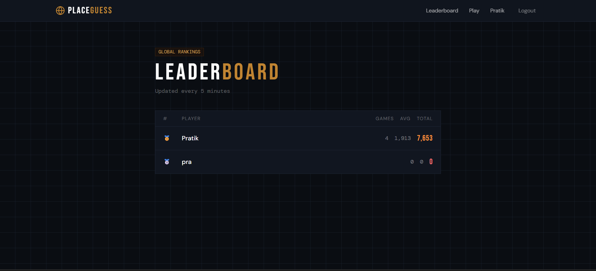
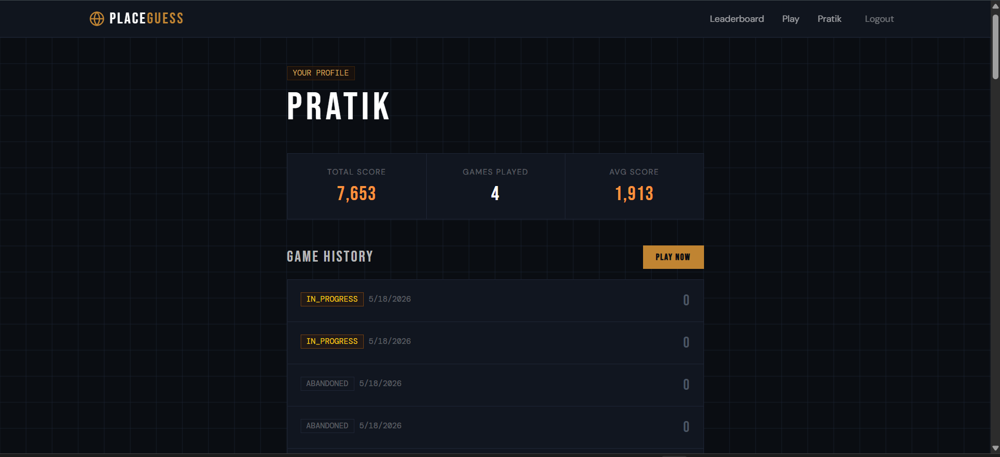

# 🌍 PlaceGuess

A GeoGuesser-inspired backend built with **Java 17 + Spring Boot 3.2.4**. Players view a random Google Street View image and guess the location — scoring up to **5,000 points** per round based on how close they are (max 5,000 km).

---

## Tech Stack

| Layer        | Technology                              |
|--------------|-----------------------------------------|
| Language     | Java 17                                 |
| Framework    | Spring Boot 3.2.4                       |
| Build        | Maven                                   |
| Database     | MySQL 8                                 |
| Cache        | Redis (leaderboard)                     |
| Auth         | Spring Security + JWT (jjwt 0.12.5)    |
| Mapping      | Google Street View Static API           |

---

## Project Structure

```
src/main/java/com/placeguess/
├── PlaceGuessApplication.java
├── config/
│   ├── SecurityConfig.java          # Spring Security + JWT filter chain
│   └── RedisConfig.java             # Redis template + cache manager
├── controller/
│   ├── AuthController.java          # /api/auth/**
│   ├── GameController.java          # /api/games/**
│   ├── LeaderboardController.java   # /api/leaderboard
│   └── UserController.java          # /api/users/me
├── dto/
│   ├── request/
│   │   ├── AuthRequest.java         # Register + Login inner classes
│   │   └── GuessRequest.java
│   └── response/
│       ├── AuthResponse.java
│       ├── GameResponse.java
│       ├── RoundResponse.java
│       ├── LeaderboardEntry.java
│       └── ApiError.java
├── entity/
│   ├── User.java
│   ├── Game.java
│   └── Round.java
├── exception/
│   ├── GlobalExceptionHandler.java
│   ├── ResourceNotFoundException.java
│   └── GameException.java
├── repository/
│   ├── UserRepository.java
│   ├── GameRepository.java
│   └── RoundRepository.java
├── security/
│   ├── JwtTokenProvider.java
│   ├── JwtAuthenticationFilter.java
│   └── CustomUserDetailsService.java
├── service/
│   ├── AuthService.java
│   ├── GameService.java
│   └── LeaderboardService.java
└── util/
    ├── GeoCalculator.java           # Haversine distance + score formula
    └── StreetViewLocationProvider.java
```

---

## Prerequisites

- Java 17
- Maven 3.9+
- MySQL 8 running locally
- Redis running locally (default port 6379)
- A Google Maps API key with **Street View Static API** enabled. A browser-side Google Maps JavaScript API key is not required.

---

## Setup

### 1. Create the MySQL database

```sql
CREATE DATABASE placeguess_db;
```

### 2. Configure `application.properties`

Edit `src/main/resources/application.properties`:

```properties
spring.datasource.username=root
spring.datasource.password=YOUR_MYSQL_PASSWORD
app.google.maps.api-key=YOUR_STREET_VIEW_STATIC_API_KEY
```

### 3. Build & run

```bash
mvn clean install -DskipTests
mvn spring-boot:run
```

The server starts at `http://localhost:8080`.

---

## API Reference

### Auth

| Method | Endpoint             | Auth | Description        |
|--------|----------------------|------|--------------------|
| POST   | `/api/auth/register` | No   | Register new user  |
| POST   | `/api/auth/login`    | No   | Login, get JWT     |

**Register**
```json
POST /api/auth/register
{
  "username": "player1",
  "email": "player1@example.com",
  "password": "secret123"
}
```

**Login**
```json
POST /api/auth/login
{
  "username": "player1",
  "password": "secret123"
}
```

Response:
```json
{
  "accessToken": "eyJhbGci...",
  "refreshToken": "eyJhbGci...",
  "tokenType": "Bearer",
  "userId": 1,
  "username": "player1",
  "email": "player1@example.com"
}
```

> All subsequent requests require `Authorization: Bearer <accessToken>`

---

### Game Flow

| Method | Endpoint                    | Auth | Description                  |
|--------|-----------------------------|------|------------------------------|
| POST   | `/api/games/start`          | Yes  | Start a new 5-round game     |
| GET    | `/api/games/{gameId}/round` | Yes  | Get current round + image URL|
| GET    | `/api/games/rounds/{roundId}/street-view` | No | Street View image proxy |
| POST   | `/api/games/guess`          | Yes  | Submit a lat/lng guess       |
| GET    | `/api/games/history`        | Yes  | Your past games              |

**Start game** → returns `GameResponse` with the first round's backend Street View image URL. The Google API key stays on the server.

**Street View controls**

Use query parameters on `streetViewUrl` to navigate and zoom the Street View image:

```text
/api/games/rounds/1/street-view?heading=90&pitch=0&fov=70
```

- `heading`: rotate left/right, `0` to `359`
- `pitch`: look up/down, `-90` to `90`
- `fov`: zoom level, `10` to `120`; lower means more zoomed in

**Submit guess**
```json
POST /api/games/guess
{
  "gameId": 1,
  "roundNumber": 1,
  "guessedLat": 48.85,
  "guessedLng": 2.35,
  "timeTakenSeconds": 23
}
```

Response reveals the actual location, distance, and score:
```json
{
  "roundId": 1,
  "roundNumber": 1,
  "streetViewUrl": "/api/games/rounds/1/street-view",
  "actualLat": 48.8584,
  "actualLng": 2.2945,
  "locationName": "Eiffel Tower, Paris, France",
  "guessedLat": 48.85,
  "guessedLng": 2.35,
  "distanceKm": 4.21,
  "score": 4916,
  "timeTakenSeconds": 23
}
```

---

### Leaderboard

| Method | Endpoint                   | Auth | Description              |
|--------|----------------------------|------|--------------------------|
| GET    | `/api/leaderboard`         | No   | Top 10 players (cached)  |
| GET    | `/api/leaderboard?limit=25`| No   | Top N players            |

---

### User

| Method | Endpoint       | Auth | Description      |
|--------|----------------|------|------------------|
| GET    | `/api/users/me`| Yes  | My profile/stats |

---

## Scoring Formula

Points per round are calculated using exponential decay:

```
score = 5000 × e^(−10 × distanceKm / 5000)
```

| Distance  | Score |
|-----------|-------|
| 0 km      | 5,000 |
| 100 km    | ~4,048|
| 500 km    | ~3,679|
| 1,000 km  | ~1,353|
| 5,000 km  | 0     |

---

## Running Tests

```bash
mvn test
```

Tests use an in-memory H2 database and mock Redis — no external services needed.

---

## Environment Variables (Production)

For production, prefer environment variables over `application.properties`:

```bash
export SPRING_DATASOURCE_PASSWORD=...
export APP_GOOGLE_MAPS_API_KEY=...
export APP_JWT_SECRET=...
export SPRING_DATA_REDIS_HOST=...
export SPRING_DATA_REDIS_PASSWORD=...
```
# Screenshots

## Home Page


## Login Page


## Signup Page


## Score Page


## Guess Round


## Leaderboard


## Profile Page

